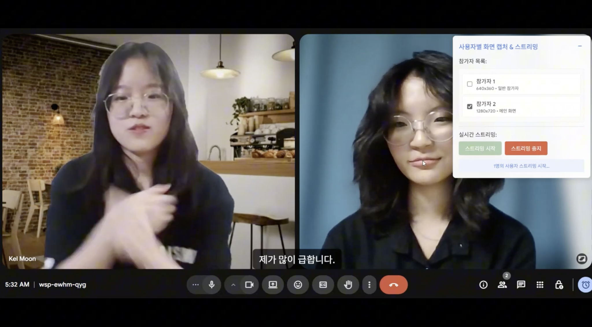
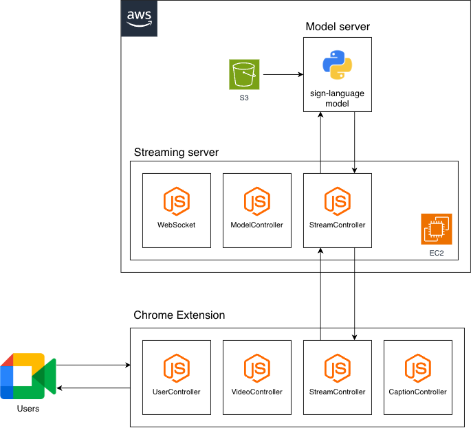
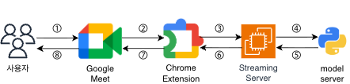

## **1. 프로젝트 개요**

**1-1. 프로젝트 소개**
- 프로젝트 명 : 실시간 수어 번역 오픈소스 프로그램 개발
- 프로젝트 정의 : 화상 회의 환경에서 AI 기술을 통해 수어를 실시간으로 인식하고, 완전한 한국어 문장으로 번역하여 농인과 비농인 간의 원활한 소통을 지원하는 확장 프로그램
  
<br>

**1-2. 개발 배경 및 필요성**
- 비대면 소통이 확산됨에 따라 다양한 실시간 번역 서비스가 등장했지만, 대부분 음성 기반으로 개발되어 수어 사용자들은 기술 발전의 혜택에서 소외되고 있었습니다. 기존의 한국수어 번역 연구 또한 단어 수준의 인식에 머물러 있어, 실제 대화처럼 문맥을 이해하고 자연스러운 문장을 생성하는 데 한계가 있었습니다. 본 프로젝트는 이러한 기술적, 사회적 장벽을 넘어, 수어를 완전한 문장 단위로 번역하여 실질적인 의사소통을 지원하고자 시작되었습니다.

**1-3. 프로젝트 특장점**
- 높은 접근성 : 별도의 프로그램 설치 없이 기존에 사용하던 화상회의 플랫폼(Google Meet 등)에서 바로 사용할 수 있는 웹 확장 프로그램 형태로 개발하여 누구나 쉽게 이용할 수 있습니다.
- 기술적 차별성 : MediaPipe로 추출한 3D 키포인트 데이터를 UMAP 알고리즘으로 압축하여 수어 동작의 핵심 특징만 추출합니다. 이를 통해 AI 모델의 학습 효율과 번역 정확도를 크게 향상했습니다.
- 사용자 중심 설계 : 개발 초기부터 실제 농인 및 청인 수어 사용자와의 심층 인터뷰를 진행하여 자막 위치, 스크립트 제공 방식 등 실질적인 필요와 요구사항을 UI/UX 설계에 충실히 반영했습니다.

**1-4. 주요 기능**
- 실시간 수어 인식 및 번역 : 화상회의 중 카메라를 통해 사용자의 수어 동작(손, 표정, 입 모양 등)을 실시간으로 인식하고, Transformer AI 모델을 통해 문맥에 맞는 자연스러운 한국어 문장으로 번역합니다.
- 실시간 자막 및 스크립트 출력 : 번역된 내용은 즉시 화상회의 화면에 자막과 전체 대화 스크립트 형태로 출력되어 대화의 흐름을 쉽게 파악할 수 있습니다.
- 번역 대상 선택 기능 : 회의 참여자 중 번역을 원하는 특정 인물의 화면을 직접 선택하여 해당 사용자의 수어만 집중적으로 번역할 수 있습니다.
- 음성 출력(TTS) 기능 : 번역된 텍스트를 음성으로 변환하여 출력함으로써, 화면을 보기 어려운 상황에서도 소통을 지원합니다.

**1-5. 기대 효과 및 활용 분야**
- 기대 효과 : 수어 사용자의 비대면 교육, 원격 근무 등 사회 참여 기회를 확대하고 디지털 정보 격차를 해소합니다. 또한, 관련 기술과 데이터를 오픈소스로 공개하여 국내 수어 연구 생태계 발전에 기여합니다.
- 활용 분야 : 원격 교육 및 화상 회의, 공공기관 및 금융권의 비대면 민원 서비스, 병원의 원격 진료 등 다양한 분야에서 활용될 수 있습니다.

**1-6. 기술 스택**
- Client (Extension) : Javascript, Webpack, Chrome Extension API
- Streaming Server : AWS EC2, WebSocket
- AI / Model Server : Python, MediaPipe, UMAP, Transformer, TensorFlow Lite
- 클라우드 : AWS
- 협업 및 관리 : Git, Github, Notion, Discord

---

## **2. 팀원 소개**
|  |  |  |  |
|:---:|:---:|:---:|:---:|
| [**최은소**](https://github.com/esc-beep) | [**문채일**](https://github.com/chae2) | [**정민서**](https://github.com/M-J1nx) | [**박은규**](https://github.com/eunkyui) |
| • PM <br> • 머신러닝 모델 개발 <br> • 데이터 엔지니어링 | • 머신러닝 모델 개발 <br> • 데이터 엔지니어링 | • 시스템 설계 <br> • 소프트웨어 개발 | • 프로젝트 멘토 <br> • 기술 자문 |

---
## **3. 시스템 구성도**
- 서비스 구성도


- 서비스 흐름도


- AI 모델 파이프라인


- 엔티티 관계도


---
## **4. 작품 소개영상**
[](https://youtu.be/mtEdTzg9rCE)

---
## **5. 핵심 소스코드**
- 소스코드 설명 : API를 활용해서 자동 배포를 생성하는 메서드입니다.

```Java
    private static void start_deployment(JsonObject jsonObject) {
        String user = jsonObject.get("user").getAsJsonObject().get("login").getAsString();
        Map<String, String> map = new HashMap<>();
        map.put("environment", "QA");
        map.put("deploy_user", user);
        Gson gson = new Gson();
        String payload = gson.toJson(map);

        try {
            GitHub gitHub = GitHubBuilder.fromEnvironment().build();
            GHRepository repository = gitHub.getRepository(
                    jsonObject.get("head").getAsJsonObject()
                            .get("repo").getAsJsonObject()
                            .get("full_name").getAsString());
            GHDeployment deployment =
                    new GHDeploymentBuilder(
                            repository,
                            jsonObject.get("head").getAsJsonObject().get("sha").getAsString()
                    ).description("Auto Deploy after merge").payload(payload).autoMerge(false).create();
        } catch (IOException e) {
            e.printStackTrace();
        }
    }
```